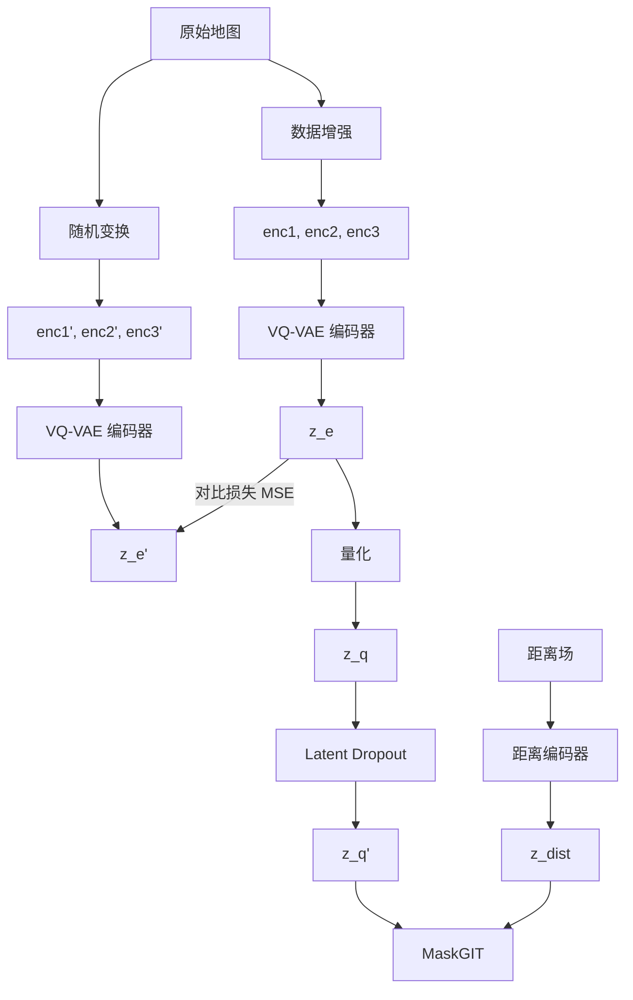
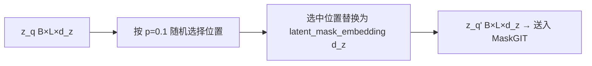
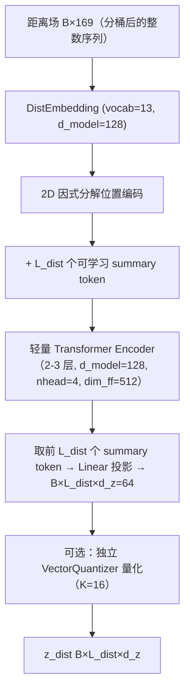

# 隐变量增强机制设计文档

## 整体架构概览



三个机制分别作用在隐变量的不同环节：

| 机制           | 作用位置          | 作用阶段  | 核心目标                           |
| -------------- | ----------------- | --------- | ---------------------------------- |
| Latent Dropout | z_q → z_q'        | 训练      | 防止解码器过度依赖特定 latent code |
| 距离场编码     | z_dist 拼接入 z_q | 训练+推理 | 注入连续空间结构信息               |
| 对比学习损失   | z_e vs z_e'       | 训练      | 强制编码器学习变换不变表示         |

---

## 机制一：Latent Dropout

### 核心思路

训练时以概率 p 随机丢弃（替换为可学习 mask token）z_q 序列中的部分 latent code，迫使 MaskGIT 解码器学会在部分码字缺失的情况下仍能合理生成，从而降低对特定码字组合的过依赖。

### 设计方案

#### Dropout 策略：可学习 Mask Token 替换

在 z_q [B, L, d_z] 上，以概率 p 将某些位置的 latent code 替换为一个可学习的 mask 嵌入向量：



选择 mask token 替换方案（而非置零或随机采码）的理由：

- **置零向量**：改变了 z_q 的范数分布（码字向量模长约为 1，零向量模长为 0），打破了量化空间的几何结构。
- **随机采码**：过于激进，可能引入语义上完全无关的码字，造成训练不稳定。
- **Mask token**：可学习的嵌入，由模型自适应确定"缺失码字"的最优替代表示，与 BERT / MaskGIT 自身的设计理念一致。

#### Dropout 率 p

- `p = 0.1` — 对于 L=16 的码字序列，平均每 batch 有 1.6 个码字被丢弃，扰动适度。
- 更激进的 `p = 0.2` 可作为消融实验的对比项。
- 推理时 p = 0（不使用 dropout）。

#### 实现位置

Latent dropout 应放在 `GinkaMaskGIT` 内部，在 z 投影之前：

```python
# 在 GinkaMaskGIT.forward 中：
if self.training and self.z_dropout > 0:
    z = self.apply_latent_dropout(z)  # 以概率 self.z_dropout 替换为 mask token
z_proj = self.z_proj(z)
```

需在 `GinkaMaskGIT.__init__` 中新增参数 `z_dropout: float = 0.0` 和 `nn.Parameter` 类型的 `latent_mask_embedding`。

#### 与现有 `MG_Z_DROPOUT` 的关系

当前 `train_seperated.py` 第 94 行已定义 `MG_Z_DROPOUT = 0.1`，但未在训练循环中使用。该常量应作为 `GinkaMaskGIT` 构造参数传入，在模型内部完成 dropout 逻辑。

### 预期效果

- codebook 使用率（usage rate）可能提升：解码器不再依赖极少数字就能生成，迫使更多码字被"激活"。
- 训练损失可能轻微上升（因为条件信号变弱），但验证时的生成质量应提升，随机采码生成效果应更稳定。

---

## 机制二：距离场编码

### 核心思路

为每个地图位置计算其到最近墙壁的 **L1（曼哈顿）距离**，构成与地图同尺寸（13×13）的距离场。距离场通过独立编码器编码为额外一组 latent code `z_dist`，与三阶段的 `z_q` 沿序列维拼接后送入 MaskGIT。

距离场提供了 tile 类别标签中不包含的连续空间信息：

- 距离墙壁越近，越适合放置墙壁相关元素（如门、角落资源）；
- 距离墙壁越远（中间区域），越适合空旷空间（通路、大面积空地）；
- 距离场的梯度方向隐含了"朝向通道/远离墙壁"的结构特征。

### 距离场计算

对于地图 M [13, 13]，设墙壁 tile ID 为 1：

$$D(i, j) = \min_{(i_w, j_w): M[i_w, j_w] = 1} \left(|i - i_w| + |j - j_w|\right)$$

距离值域为 [0, 24]（13×13 网格中最远曼哈顿距离为 12+12=24）。计算实现：

```python
def compute_distance_field(map_matrix: np.ndarray) -> np.ndarray:
    # map_matrix: [13, 13] 整数矩阵
    # 返回: [13, 13] 浮点矩阵，每格为到最近墙壁的曼哈顿距离
    wall_mask = (map_matrix == 1)
    # 直接距离变换
    from scipy.ndimage import distance_transform_cdt
    return distance_transform_cdt(~wall_mask, metric='taxicab').astype(np.float32)
```

若无 scipy 依赖，也可使用纯 numpy 的 BFS 或多源扩展实现。

#### 距离归一化

距离值需要归一化到合理范围以便编码器处理。推荐**分桶嵌入**（类似 tile embedding）：

| 方案     | 做法                                   | 优点                       |
| -------- | -------------------------------------- | -------------------------- |
| 连续值   | 归一化到 [0, 1]，经 MLP 映射为嵌入     | 保留精确距离               |
| 分桶嵌入 | 距离离散化为 N 个桶，用 Embedding 查表 | 与 tile embedding 风格统一 |

**推荐分桶嵌入**：将距离离散化到 [0, MAX_DIST] 的整数（截断到 MAX_DIST），再用 Embedding 映射。MAX_DIST 可取 12（超过该距离的格子极少，且距离语义趋于饱和），共计 13 个桶（0-12）。

### 编码器设计

距离场编码器使用与 `GinkaVQVAE` 相同的 Transformer 架构、但参数更轻量的独立实例：



#### 设计要点

| 参数       | 建议值 | 说明                                     |
| ---------- | ------ | ---------------------------------------- |
| L_dist     | 4      | 距离场信息量低于 tile 类别，4 个码字足够 |
| d_model    | 128    | 比 VQ-VAE 的 256 更轻量                  |
| num_layers | 3      | 信息密度低，浅层即可编码                 |
| K_dist     | 16     | 距离场 codebook 容量（可选，见下方讨论） |

#### 是否需要量化距离场 z

距离场是连续信号，原则上不需要 VQ 量化。但考虑以下因素后**推荐量化**：

- **推理统一性**：推理时 z 均从 codebook 采样，若 z_dist 连续则无对应采样机制，只能从训练集的距离场编码获得，破坏了"用户无需任何输入"的设计目标。
- **正则化效果**：量化对距离场编码施加信息瓶颈，迫使编码器提取高层结构特征而非记忆具体距离值。
- 实现简单：复用现有 `VectorQuantizer`，只需 K=16 的小型 codebook。

推理时 z_dist 与三阶段 z_q 均可从各自 codebook 独立随机采样。

### 拼接与注入方式

z_dist 直接拼接到 z_q 序列后，通过现有的 `cond_proj` 投影为 AdaLN 条件向量：

```python
# 当前：cond_seq = cat([z_proj, e_struct, e_remain])  # [B, L+2+5, d_z]
# 修改后：
z_proj = self.z_proj(z_q)        # [B, L, d_z]
zd_proj = self.zd_proj(z_dist)   # [B, L_dist, d_z]
cond_seq = torch.cat([z_proj, zd_proj, e_struct, e_remain], dim=1)
# cond_seq: [B, L + L_dist + 2 + 5, d_z]
c = self.cond_proj(cond_seq.reshape(B, -1))  # [B, d_model]
```

需要在 `GinkaMaskGIT` 中：

- 新增 `z_dist_proj`（`nn.Linear(d_z, d_z)`）
- 修改 `cond_proj` 输入维度：`(z_seq_len + L_dist + 2 + 5) * d_z`
- `forward` 签名新增 `z_dist: torch.Tensor` 参数

#### 距离场来源

距离场由**全量地图的墙壁布局**决定，与哪个阶段无关。因此 z_dist 由**一份全量地图的距离场**编码得到，在三阶段间共享使用。实际编码时以 `encoder_stage1`（或 raw_map）中的墙壁为基础计算距离场，因为只有 stage1 保留了完整的墙壁信息。

```python
# 训练循环中：
dist_field = compute_distance_field(enc1)  # enc1 含完整墙壁
z_dist = dist_encoder(dist_field)          # 共用一份距离场编码
z_dist = dist_quantizer(z_dist)            # 可选量化

# 三阶段 MaskGIT 前向均传入同一 z_dist
logits1 = mg1(inp1, z_q1, z_dist, struct, remain1)
logits2 = mg2(inp2, z_q2, z_dist, struct, remain2)
logits3 = mg3(inp3, z_q3, z_dist, struct, remain3)
```

---

## 机制三：对比学习损失

对同一原始地图施加两种随机等距变换后分别通过编码器，约束两个视图的 latent z_e 尽可能相似，损失使用 MSE：

$$\mathcal{L}_{contrast} = \text{MSE}(z_e, z_e')$$

其中 $T_1, T_2$ 从 8 种等距变换中独立随机采样。

### 为何选择 MSE 而非 InfoNCE

| 损失函数        | 适用场景                      | 当前适用性                                    |
| --------------- | ----------------------------- | --------------------------------------------- |
| **MSE（推荐）** | 正样本对已知且应完全相同      | 变换前后 z_e 应一致，MSE 直接约束             |
| InfoNCE         | 正负样本对需要从 batch 内挖掘 | batch 中不同地图的 z 理应不同，负样本客观存在 |

考虑到：

- 同一地图的变换版本理应映射到同一 code 序列（或至少相邻 code），直接 MSE 约束更精准；
- InfoNCE 将"与 batch 内其他样本拉开距离"作为负约束，但在语义层面上两张不同地图的 z 未必应该远离（结构相似的地图应有相近的 z），这可能引入噪声；
- MSE 实现更简单，计算量更低。

若实验中发现 MSE 导致 codebook 坍缩（所有 z_e 趋同），可替换为 NT-Xent（SimCLR 风格），通过温度参数控制分布的熵。

### 变换集合

对 13×13 的二维网格，以下 8 种变换构成等距变换群（D4 二面体群）：

| 编号 | 变换                                  |
| ---- | ------------------------------------- |
| T0   | 恒等（无变换）                        |
| T1   | 旋转 90° 顺时针                       |
| T2   | 旋转 180°                             |
| T3   | 旋转 270° 顺时针（等价于 90° 逆时针） |
| T4   | 水平翻转                              |
| T5   | 垂直翻转                              |
| T6   | 主对角线翻转（转置）                  |
| T7   | 副对角线翻转                          |

每次构造样本对时，从 8 种变换中独立随机采样两个（允许相同，即 T_i = T_j）。

### 训练流程

对比损失在**训练循环**中计算，不与数据集的在线增强耦合：

```
1. 从 dataset 获取 batch（已经过随机增强，用于 MaskGIT 训练目标）
2. 取各阶段的 encoder 输入 enc1, enc2, enc3（均保留完整上下文）
3. 对 enc1/enc2/enc3 分别施加随机变换 T_a，编码得 z_e_a
4. 对 enc1/enc2/enc3 分别施加随机变换 T_b，编码得 z_e_b
5. 计算三阶段的 MSE(z_e_a, z_e_b)，求和作为总对比损失
```

需注意：

- 当前 dataset 的 `__getitem__` 已对原始地图施加了在线增强（随机旋转/翻转）。对比损失所需的原始 → 变换流程需独立于该增强，在编码阶段重新获取变换前的地图。最简单的方式是在 dataset 中新增返回字段 `raw_map`（未经增强的完整地图），或从 `encoder_stage3`（含所有 tile）中取墙壁信息复原。
- 建议在 dataset 中新增 `raw_map` 字段：返回增强前（或逆增强后）的完整地图 [13, 13]，用于对比学习的变换和距离场计算。

### 损失权重与调度

$$\mathcal{L}_{total} = \mathcal{L}_{CE} + \beta \cdot \mathcal{L}_{commit} + \lambda_{contrast} \cdot \mathcal{L}_{contrast}$$

- $\lambda_{contrast} = 0.1$ 作为初始值
- 若训练早期对比损失较大导致模型不稳定，可在前 N 个 epoch 线性 warmup $\lambda_{contrast}$ 从 0 到目标值
- 若 codebook 使用率下降（熵减小），需降低 $\lambda_{contrast}$ 或切换为 InfoNCE

### 与距离场编码器的关系

距离场编码器同样受益于对比学习约束——对地图施加等距变换后，距离场也相应变换，但距离场编码器应输出相同的 z_dist。因此对比损失也应作用于距离场编码器：

$$\mathcal{L}_{contrast}^{dist} = \text{MSE}(z_{dist}, z_{dist}')$$

可在距离场编码器内部或外部实现，权重与主对比损失相同。

---

## 数据集调整

三个机制均需要额外的数据字段，需调整 `GinkaSeperatedDataset`：

### 新增字段

| 字段名           | 形状     | 说明                                        |
| ---------------- | -------- | ------------------------------------------- |
| `raw_map`        | [13, 13] | 未经增强的原始完整地图（所有 tile 类别）    |
| `distance_field` | [169]    | 从 raw_map 的墙壁计算的 L1 距离场（分桶后） |

### 实现要点

1. `raw_map`：在 `__getitem__` 中，先保存 raw_map，再施加在线数据增强得到各阶段输入。
2. `distance_field`：从 `raw_map` 计算，与在线增强无关（距离场由原图墙壁决定，增强不影响墙壁的相对位置关系）。

---

## 模型与训练流程变更

### 新增/修改的模块

| 模块                    | 变更类型 | 说明                                               |
| ----------------------- | -------- | -------------------------------------------------- |
| `GinkaMaskGIT`          | 修改     | 新增 z_dropout, latent_mask_embedding, z_dist 处理 |
| `DistFieldEncoder`      | 新增     | 距离场编码器（轻量 GinkaVQVAE 变体）               |
| `GinkaSeperatedDataset` | 修改     | 新增 raw_map, distance_field 字段                  |
| `train_seperated.py`    | 修改     | 集成三个机制的训练逻辑                             |

### 训练循环伪码

```python
# 每个训练 step：
enc1, enc2, enc3, inp1, inp2, inp3, target1, target2, target3,
    struct, target_density, raw_map, dist_field = batch

# === VQ 编码 ===
z_e1, z_e2, z_e3 = vq1(enc1), vq2(enc2), vq3(enc3)
z_q1, z_q2, z_q3 = quantize(z_e1, z_e2, z_e3)

# === 距离场编码 ===
z_e_dist = dist_encoder(dist_field)
z_dist = dist_quantizer(z_e_dist)

# === 对比损失 ===
# 对 raw_map 施加两种随机变换，编码两次
enc1_a, enc2_a, enc3_a = apply_transform(raw_map, T_a)
enc1_b, enc2_b, enc3_b = apply_transform(raw_map, T_b)
z_e1_a, z_e2_a, z_e3_a = vq1(enc1_a), vq2(enc2_a), vq3(enc3_a)
z_e1_b, z_e2_b, z_e3_b = vq1(enc1_b), vq2(enc2_b), vq3(enc3_b)
loss_contrast = (
    mse(z_e1_a, z_e1_b) + mse(z_e2_a, z_e2_b) + mse(z_e3_a, z_e3_b)
) / 3

# 距离场对比
dist_a = apply_transform(dist_field, T_a)
dist_b = apply_transform(dist_field, T_b)
z_e_dist_a = dist_encoder(dist_a)
z_e_dist_b = dist_encoder(dist_b)
loss_contrast += mse(z_e_dist_a, z_e_dist_b)

# === MaskGIT 前向（Latent Dropout 在 mg 内部） ===
logits1 = mg1(inp1, z_q1, z_dist, struct, remain1)
logits2 = mg2(inp2, z_q2, z_dist, struct, remain2)
logits3 = mg3(inp3, z_q3, z_dist, struct, remain3)

# === 总损失 ===
loss = (
    STAGE1_CE_WEIGHT * ce(logits1, target1)
    + STAGE2_CE_WEIGHT * ce(logits2, target2)
    + STAGE3_CE_WEIGHT * ce(logits3, target3)
    + VQ_BETA * commit_loss
    + VQ_BETA_DIST * commit_loss_dist
    + LAMBDA_CONTRAST * loss_contrast
)
```

### 新增超参

| 参数              | 建议值 | 说明                          |
| ----------------- | ------ | ----------------------------- |
| `Z_DROPOUT`       | 0.1    | latent dropout 概率           |
| `L_DIST`          | 4      | 距离场码字序列长度            |
| `K_DIST`          | 16     | 距离场 codebook 大小          |
| `DIST_D_MODEL`    | 128    | 距离场编码器模型维度          |
| `DIST_LAYERS`     | 3      | 距离场编码器 Transformer 层数 |
| `DIST_DIM_FF`     | 512    | 距离场编码器 FF 维度          |
| `DIST_MAX_BUCKET` | 12     | 距离分桶上限                  |
| `LAMBDA_CONTRAST` | 0.1    | 对比损失权重                  |
| `VQ_BETA_DIST`    | 0.5    | 距离场 commit loss 权重       |

---

## 实施建议

### 阶段一：Latent Dropout（最低风险，最快落地）

1. 在 `GinkaMaskGIT` 中新增 `z_dropout` 参数和 `latent_mask_embedding`；
2. 在 `build_model` 中将 `MG_Z_DROPOUT` 传入各 mg 实例；
3. 训练并观察 codebook usage rate 和生成质量的变化。

### 阶段二：距离场编码（中等复杂度）

1. 实现距离场计算函数（`shared/distance.py`）；
2. 实现 `DistFieldEncoder` 类（参考 `GinkaVQVAE` 结构，更轻量）；
3. 修改 `GinkaSeperatedDataset`，新增 `raw_map` 和 `distance_field`；
4. 修改 `GinkaMaskGIT` 的 `forward` 签名和 `cond_proj` 维度；
5. 修改训练循环，加入距离场编码和前向链路。

### 阶段三：对比学习损失（最后接入）

1. 实现等距变换工具函数（`shared/transforms.py`）；
2. 在训练循环中加入对比损失计算；
3. 监控 codebook 熵的变化，按需调整 `LAMBDA_CONTRAST`；
4. 与阶段一、二的成果叠加训练。

### 整体叠加

三个阶段不冲突，建议按顺序逐层加入，每次加入后充分训练验证，确保新机制没有破坏已有成果后再推进下一阶段。最终三者叠加后，预期模型在随机采码推理时的生成多样性和结构合理性均应有明显提升。

---

## 消融实验建议

为验证各机制的有效性，建议进行以下消融实验：

| 实验编号 | Latent Dropout | 距离场编码 | 对比损失 | 目的                    |
| -------- | -------------- | ---------- | -------- | ----------------------- |
| E0       | ✗              | ✗          | ✗        | 基线（当前模型）        |
| E1       | ✓              | ✗          | ✗        | 单独验证 latent dropout |
| E2       | ✗              | ✓          | ✗        | 单独验证距离场编码      |
| E3       | ✗              | ✗          | ✓        | 单独验证对比损失        |
| E4       | ✓              | ✓          | ✗        | latent dropout + 距离场 |
| E5       | ✓              | ✓          | ✓        | 三者全叠加（目标方案）  |

每个实验使用相同随机种子、相同训练轮数，对比以下指标：

- 验证集 CE 损失（三阶段分别）
- Codebook usage rate / perplexity
- 随机采码生成地图的墙壁连通性、各类 tile 密度偏差
- 可视化对比（随机采码 5 次生成的地图一致性）
